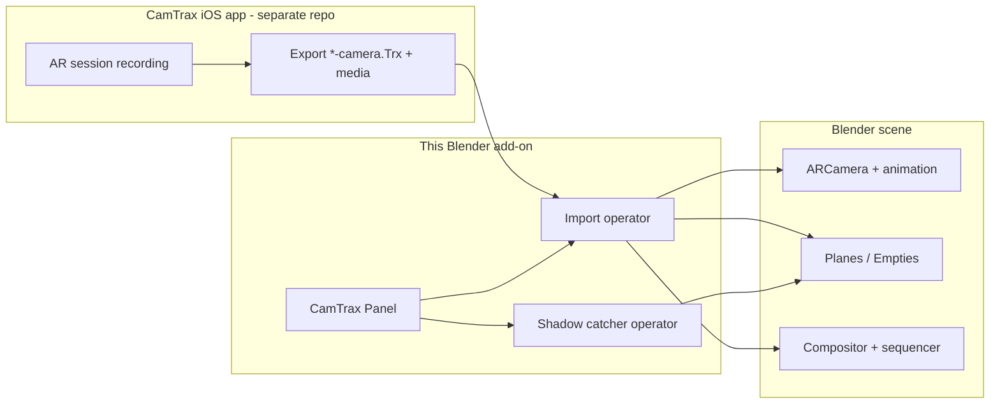
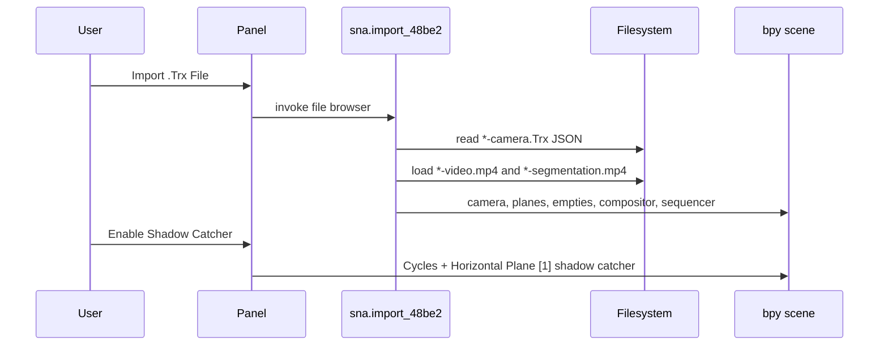

# Architecture

## Overview

CamTrax ships as a **single-module Blender add-on**. All runtime logic lives in [`__init__.py`](../__init__.py). There are no subpackages, network calls, or external Python dependencies beyond the Blender Python API (`bpy`, `bpy_extras`, `mathutils`) and the Python standard library (`json`, `os`, `math`).

## Registration

`register()` / `unregister()` in `__init__.py`:

1. Create or remove a `bpy.utils.previews` collection for the panel logo (`assets/logo2.png`).
2. Register / unregister three classes:
   - `SNA_PT_CAMTRAX_PANEL_4FD3F` — sidebar panel
   - `SNA_OT_Import_48Be2` — `.Trx` import (`ImportHelper`)
   - `SNA_OT_Shadow_992D5` — enable shadow catcher on `Horizontal Plane [1]`

An `addon_keymaps` dict exists and is cleared on unregister, but **no keymaps are registered** in the current code.

Class names use a `SNA_` prefix and hashed suffixes (Serpens-style generated identifiers). Treat them as stable `bl_idname`s unless intentionally renaming operators/panels (which breaks saved keymaps and scripts that call them).

## UI

| Property | Value |
|----------|--------|
| Panel `bl_idname` | `SNA_PT_CAMTRAX_PANEL_4FD3F` |
| Space / region | `VIEW_3D` / `UI` |
| Sidebar category | `CamTrax` |
| Label | `CamTrax Panel` |

The panel draws:

1. Preview icon from `assets/logo2.png` (via `load_preview_icon`)
2. Version label text `CamTrax v1.0.0`
3. Operator button **Import .Trx File** → `sna.import_48be2`
4. Operator button **Enable Shadow Catcher** → `sna.shadow_992d5`

## Operators

### Import — `sna.import_48be2`

- Mixes in `bpy_extras.io_utils.ImportHelper`
- File filter: `*.Trx` (`filter_glob`)
- Custom property: `sna_path` (string, file path subtype; not used as the primary path — `self.filepath` from `ImportHelper` drives import)
- On execute: nested helpers `create_node_graph` and `import_Trxfile` run with `create_nodes=True` and `switch_to_cam=True`

High-level import steps (`import_Trxfile`):

1. Parse `.Trx` JSON
2. Optionally build compositor graph and set Standard view transform + FFmpeg render defaults
3. Apply FPS, resolution, transparent film, AAC audio codec
4. Create root empty `Imported Tracking Data`
5. Create `ARCamera` with vertical sensor fit, mm lens unit, movie-clip background, orientation-aware crop/rotation
6. Add background audio to the sequence editor
7. Point 3D views at the new camera (camera perspective when `switch_to_cam`)
8. Keyframe camera location/rotation and lens from timestamps
9. Instantiate planes and tracked empties under the root
10. Select the camera

### Shadow catcher — `sna.shadow_992d5`

- Poll: fails (returns false) when `bpy.data.objects['Horizontal Plane [1]'].is_shadow_catcher` is already true; assumes that object exists
- Execute: sets `is_shadow_catcher = True`, `render.engine = 'CYCLES'`, unhides the plane for render, and enables camera/diffuse/glossy visibility on it

## Manifest and metadata

[`blender_manifest.toml`](../blender_manifest.toml) (Blender extensions):

| Field | Value |
|-------|--------|
| `id` | `camtrax` |
| `version` | `1.0.0` |
| `name` | `CamTrax` |
| `type` | `add-on` |
| `blender_version_min` | `3.0.0` |
| `tags` | `Import-Export` |
| `license` | `SPDX:GPL-2.0-or-later` |
| `website` | `camtrax.io` |

Legacy `bl_info` in `__init__.py` mirrors name/version/category and requires Blender `(3, 0, 0)`.

## Data flow (import)

## What this repository does not contain

- iOS / ARKit capture code
- Network APIs, auth, or cloud sync
- Database or persistent settings beyond Blender scene state
- Automated tests or CI workflows
- Build tooling other than packaging the folder/zip for Blender install
